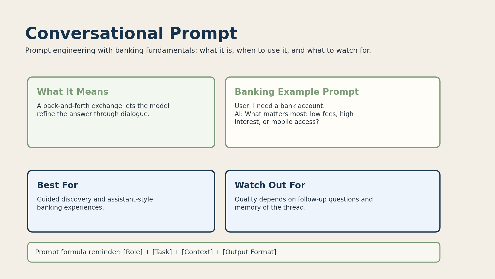

# 01. Introduction

## What is this project?

This project explains prompt engineering and language model internals together.

We use banking fundamentals as the scenario for every tutorial because banking language is practical, structured, and easy to reason about.

Instead of jumping straight into huge production models, we start with a tiny system that still captures the key ideas:

- write a prompt
- break the prompt into tokens
- turn tokens into vectors
- let tokens attend to each other
- train the model to predict the next token
- generate text one token at a time

## What is a prompt?

A prompt is the input or instruction you give to an AI model.

It can be:

- a question
- a command
- a scenario
- a role plus a task

Banking examples:

```text
What is a savings account?
Write a summary of loan repayment in simple language.
You are a banking tutor. Explain interest rates to a teenager.
```

The quality of the prompt strongly affects the quality of the response.

## Prompt engineering lens

Throughout this repository, we use a simple prompt-writing framework:

```text
[Role] + [Task] + [Context] + [Output Format]
```

Example:

```text
You are a fintech product manager.
Design a chatbot for loan applications.
Target users are first-time borrowers.
Output as a step-by-step flow.
```

This helps us connect prompt design with model behavior.

## Why prompts matter inside the model

A model does not see meaning directly. It sees tokens and patterns.

Example prompt:

```text
You are a banking tutor. Explain a mortgage.
```

The model breaks this into pieces, converts those pieces into vectors, and predicts the next token based on what it learned during training.

## Intuition

You can think of the model as a pattern-completion system.

It does not understand banking like a human banker. It learns statistical relationships between words and phrases.

Example:

```text
A savings account helps people store money.
```

After seeing many examples like that, the model learns that `savings` often appears near `account`, `interest`, and `money`.

## What you will learn

By the end of this repository, you should be able to explain:

- what a prompt is
- how prompt wording changes model behavior
- what tokenization does
- what embeddings are
- how self-attention works
- why transformer blocks are powerful
- how next-token training works
- how inference differs from training

## Banking scenario used throughout

Our examples focus on common banking topics:

- savings accounts
- checking accounts
- loans
- interest rates
- central banking
- risk management
- fraud detection

That gives us a clear and realistic domain for both prompt design and model internals.

## Prompt Type Visual Gallery

### Zero-shot prompt


### One-shot prompt


### Few-shot prompt


### Instruction-based prompt


### Role-based prompt


### Chain-of-thought prompt


### Contextual prompt


### Conversational prompt



### Output-constrained prompt


### Creative prompt


