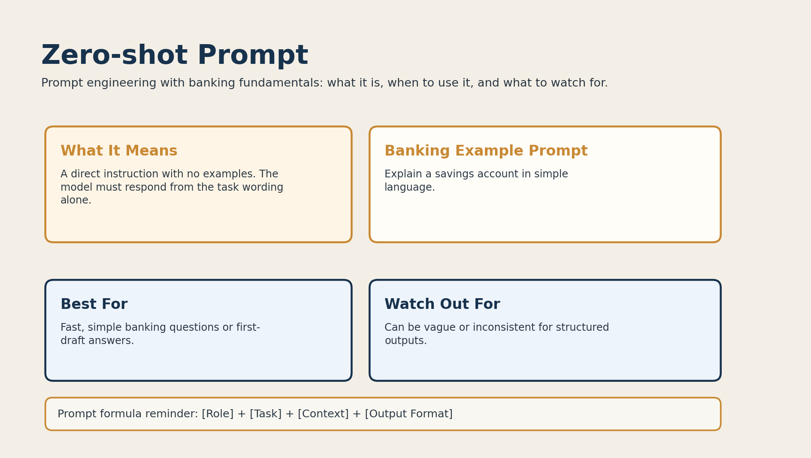

# 01. Zero-shot Prompt



## What it is

A zero-shot prompt gives the model a direct instruction without any examples.

The model has to rely only on:

- the task wording
- the training it already has
- the context inside the prompt itself

## Banking fundamentals example

```text
Explain a savings account in simple language.
```

This prompt is short and clear. It works well because the task is simple and the banking concept is familiar.

## When to use it

Use zero-shot prompting when:

- the banking topic is straightforward
- you want a fast first draft
- you do not need strict output structure

Example use cases:

- explain what a savings account is
- define interest in one paragraph
- summarize what a bank does

## Why it works

The prompt gives the model one clear job with minimal overhead.

That makes it efficient, but also less controlled than other prompt types.

## Limitations

Zero-shot prompts can become weak when:

- the banking task is complex
- the output format matters
- the answer needs precise classification or consistency

## Better version

If the zero-shot prompt is too generic, you can strengthen it:

```text
You are a banking tutor. Explain a savings account to a teenager in 3 bullet points.
```
