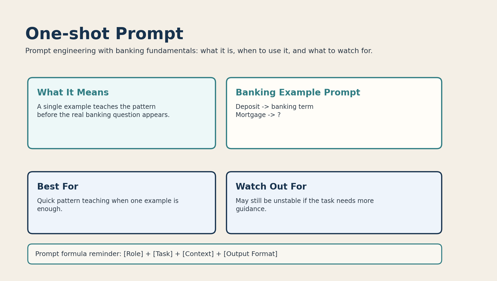

# 02. One-shot Prompt



## What it is

A one-shot prompt gives the model one example before the real task.

That example shows the pattern you want the model to follow.

## Banking fundamentals example

```text
Deposit -> banking term
Mortgage -> ?
```

The first line teaches the mapping style. The model then applies the same idea to the second line.

## When to use it

Use one-shot prompting when:

- one clear example is enough to teach the pattern
- you want more control than zero-shot
- the task is simple classification or formatting

Example use cases:

- label banking terms
- map products to categories
- format short product explanations

## Why it works

The model sees a mini demonstration before answering.

That reduces ambiguity and usually improves consistency.

## Limitations

One example may not be enough when:

- the task has multiple edge cases
- the banking categories are subtle
- the output format must be very stable

## Better version

If one example is not enough, move to few-shot prompting:

```text
Savings account -> deposit product
Mortgage -> loan product
Credit card -> ?
```
