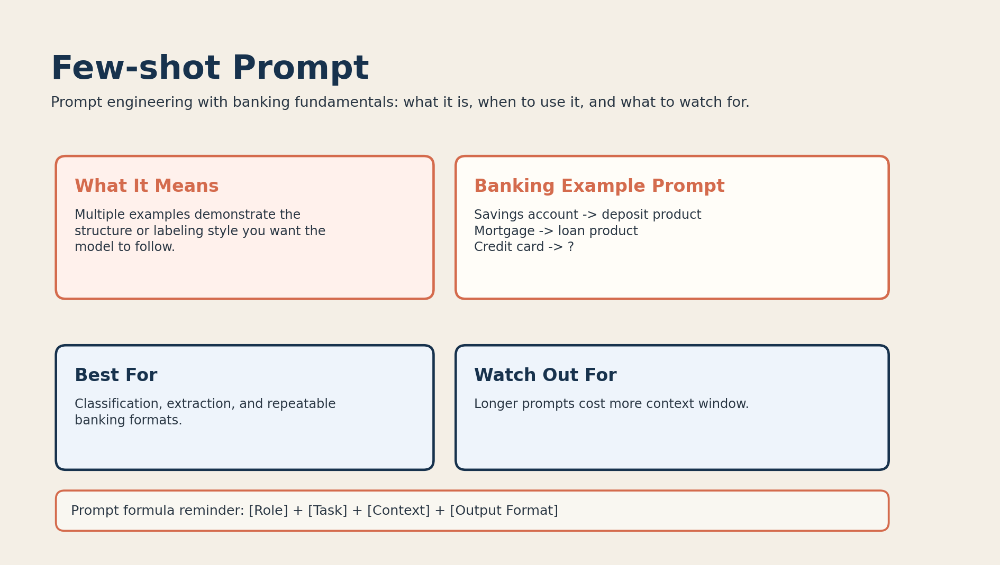

# 03. Few-shot Prompt



## What it is

A few-shot prompt gives the model multiple examples before the final task.

This is useful when you want the response to follow a repeatable pattern.

## Banking fundamentals example

```text
Savings account -> deposit product
Mortgage -> loan product
Credit card -> ?
```

Now the model sees more than one example, so the pattern is easier to infer.

## When to use it

Use few-shot prompting when:

- you need structured outputs
- you want more consistent banking classifications
- the task includes examples, labels, or formatting rules

Example use cases:

- classify financial products
- extract banking entities
- convert banking text into a fixed schema

## Why it works

Multiple examples reduce confusion.

The model can compare patterns across the examples before producing its answer.

## Limitations

Few-shot prompts cost more tokens and can become long.

That matters when:

- the context window is limited
- the examples are repetitive
- the task could have been solved with a simpler prompt

## Banking tip

Choose examples that are:

- short
- representative
- clearly labeled

Bad examples teach bad patterns.
