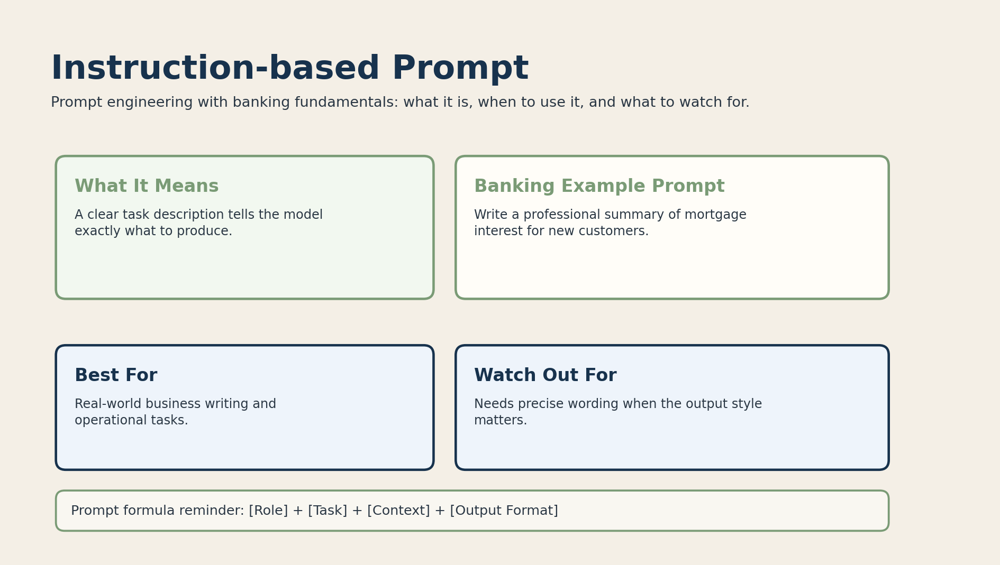

# 04. Instruction-based Prompt



## What it is

An instruction-based prompt tells the model exactly what task to perform.

It focuses on the command itself rather than examples.

## Banking fundamentals example

```text
Write a professional summary of mortgage interest for new customers.
```

This prompt is direct and practical. It tells the model what to produce and who the answer is for.

## When to use it

Use instruction-based prompting when:

- the task is clear
- you want a specific deliverable
- the response should match a business purpose

Example use cases:

- write a loan summary
- draft a customer FAQ answer
- explain KYC requirements in plain language

## Why it works

The prompt reduces uncertainty by clearly naming the task.

This is one of the most common prompt types in production systems.

## Limitations

If the instruction is vague, the output can still drift.

For example:

```text
Write about loans.
```

That is much weaker than:

```text
Write a short, professional explanation of personal loans for first-time borrowers.
```
