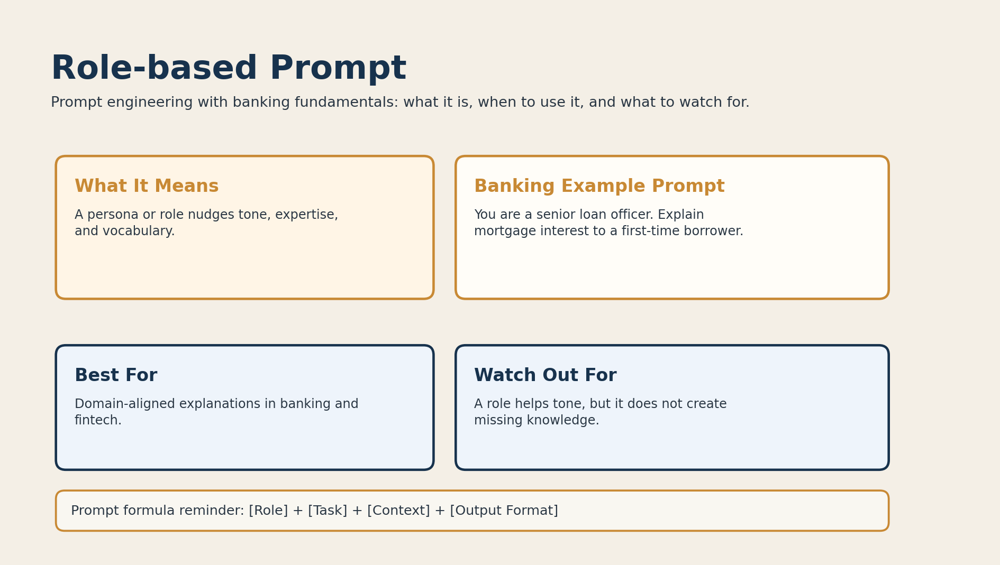

# 05. Role-based Prompt



## What it is

A role-based prompt assigns a persona to the model.

That role influences:

- tone
- framing
- vocabulary
- explanation style

## Banking fundamentals example

```text
You are a senior loan officer. Explain mortgage interest to a first-time borrower.
```

This prompt helps the answer sound more domain-aware and customer-focused.

## When to use it

Use role-based prompting when:

- the response should sound like a domain expert
- the audience matters
- tone is important

Example use cases:

- branch manager explanation
- loan officer guidance
- fintech product manager recommendations

## Why it works

Role words help the model choose a more suitable style for the task.

## Limitations

A role improves framing, but it does not create real expertise.

If the model lacks training on a banking topic, the role alone will not fix that.

## Banking tip

Combine role-based prompting with audience context:

```text
You are a banking tutor. Explain overdraft fees to a college student.
```
