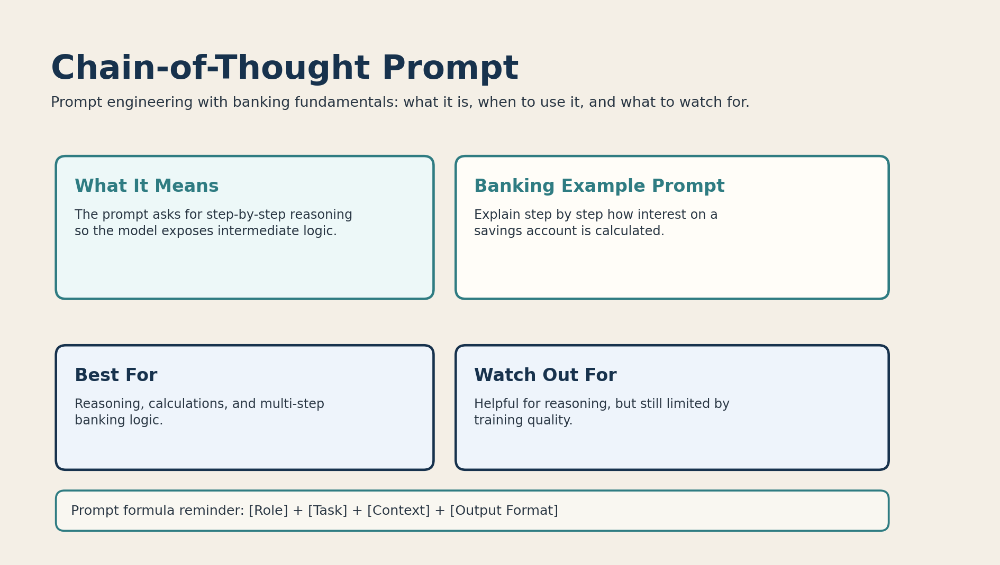

# 06. Chain-of-Thought Prompt



## What it is

A chain-of-thought prompt asks the model to reason step by step.

This is useful when the answer involves intermediate logic.

## Banking fundamentals example

```text
Explain step by step how interest on a savings account is calculated.
```

This prompt encourages the model to walk through the process instead of jumping straight to a short answer.

## When to use it

Use chain-of-thought prompting when:

- the banking topic involves calculation
- the task has several logical steps
- you want a teaching-style explanation

Example use cases:

- interest calculation
- loan repayment logic
- policy-rate effects on borrowing

## Why it works

The model is nudged to expose intermediate reasoning rather than only the final statement.

## Limitations

Step-by-step prompts are helpful, but they still depend on the model’s underlying knowledge.

If the model learned weak or incorrect patterns, the reasoning can still be wrong.

## Banking tip

This prompt type works especially well in educational banking content.
