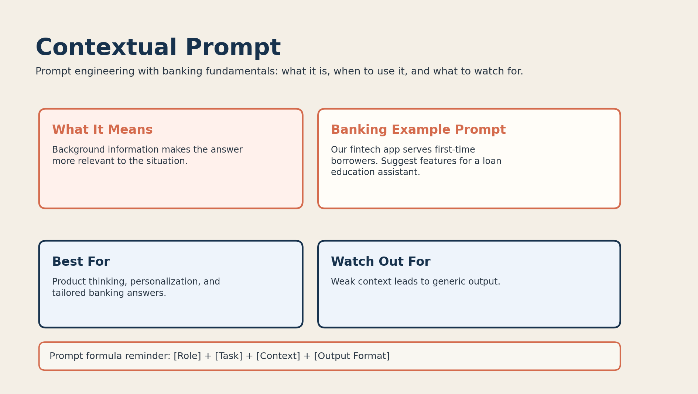

# 07. Contextual Prompt



## What it is

A contextual prompt provides background information before the task.

That helps the model tailor the answer to a specific situation.

## Banking fundamentals example

```text
Our fintech app serves first-time borrowers. Suggest features for a loan education assistant.
```

The model now knows:

- the product setting
- the audience
- the goal

## When to use it

Use contextual prompting when:

- user background matters
- business context matters
- you want less generic output

Example use cases:

- product feature ideation
- customer support guidance
- segment-specific financial education

## Why it works

More relevant context usually produces more relevant answers.

## Limitations

Weak or missing context often leads to generic output.

Too much irrelevant context can also distract the model.

## Banking tip

Include only the context that changes the answer.
