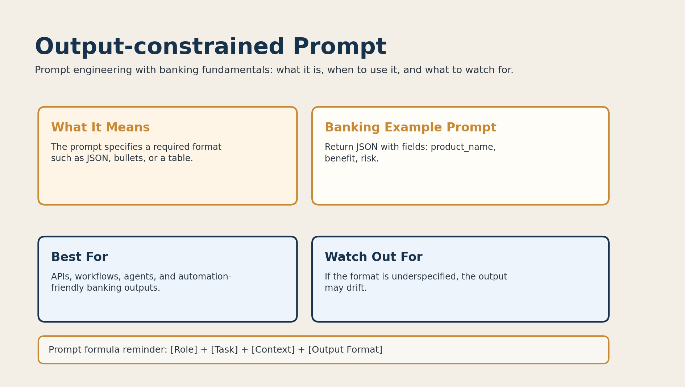

# 09. Output-constrained Prompt



## What it is

An output-constrained prompt tells the model exactly how the response should be formatted.

That format might be:

- JSON
- bullets
- a table
- named fields

## Banking fundamentals example

```text
Return JSON with fields: product_name, benefit, risk.
```

This is useful when the output needs to be consumed by a system or workflow.

## When to use it

Use output-constrained prompting when:

- the output goes into an API or automation pipeline
- consistency matters
- the answer must be machine-readable

Example use cases:

- banking product comparison data
- structured compliance checks
- agent workflows

## Why it works

The prompt narrows the answer space by telling the model what shape the output must take.

## Limitations

If the format instructions are incomplete, the model may still drift.

## Banking tip

Be explicit:

```text
Return valid JSON only. Include the fields: product_name, benefit, risk.
```
