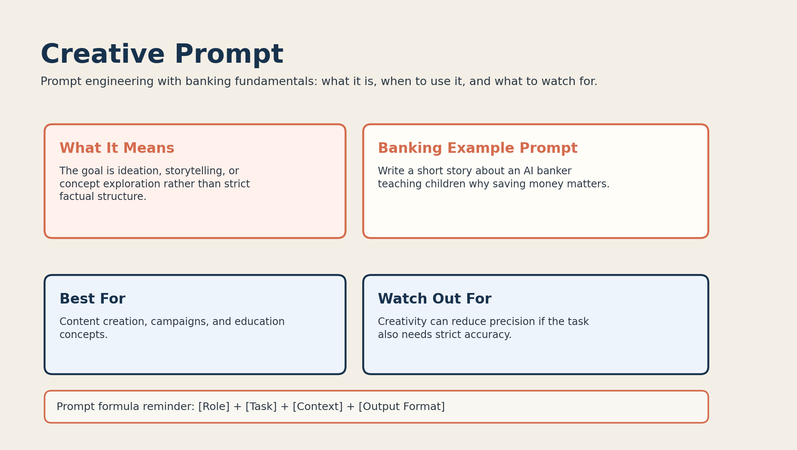

# 10. Creative Prompt



## What it is

A creative prompt is used for storytelling, brainstorming, campaigns, or concept generation.

The goal is not strict structure. The goal is imaginative output.

## Banking fundamentals example

```text
Write a short story about an AI banker teaching children why saving money matters.
```

This prompt uses a banking theme but asks for a creative response.

## When to use it

Use creative prompting when:

- you want marketing ideas
- you want educational storytelling
- you want a more engaging way to explain finance

Example use cases:

- financial literacy stories
- campaign concepts
- explainer content ideas

## Why it works

Creative prompts give the model space to explore tone, narrative, and imagery.

## Limitations

Creative prompting can reduce precision if the same task also needs strict factual control.

## Banking tip

For financial education, creative prompts work best when paired with a clear audience:

```text
Write a short story for teenagers about why emergency savings matter.
```
